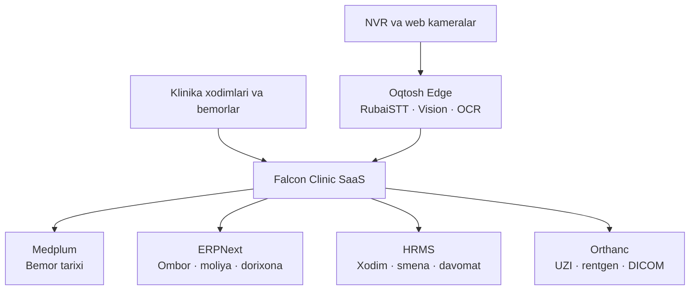

# Falcon AI OS — Yakuniy Platforma Arxitekturasi va Roadmap

> Holat bahosi: 2026-08-25. Bu hujjat — Falcon AI OS'ni to'laqonli klinika
> SaaS platformasiga aylantirish bo'yicha yakuniy qarorlar va 15 ta asosiy PR
> ro'yxati.

## O'rganilgan tizimlar

* [Falcon AI OS](https://github.com/oybekchoriev94-maker/falcon-ai-os) — kod, agentlar, backend/frontend, deployment va xavfsizlik auditi.
* Kamera.zip — NVR, webcam, Face ID, YOLO, PHP panel va Ubuntu deployment'ni faylma-fayl audit qilindi.
* RubaiSTT — Oqtoshdagi real test natijasi va lokal integratsiya arxitekturasi.
* [Medplum](https://github.com/medplum/medplum), [ERPNext](https://github.com/frappe/erpnext), [Frappe HRMS](https://github.com/frappe/hrms), [Orthanc](https://github.com/orthanc-server/orthanc-setup-samples), [Paperless-ngx](https://github.com/paperless-ngx/paperless-ngx), [PaddleOCR](https://github.com/PaddlePaddle/PaddleOCR) va [Frigate](https://github.com/blakeblackshear/frigate) — Falcon uchun vazifasi, integratsiyasi va litsenziya nuqtai nazaridan baholandi.

> **Halol xulosa:** har bir ulkan upstream repository'ning barcha qatorlarini
> audit qilish shart emas. Biz ularni qayta yozmaymiz; rasmiy barqaror mahsulot
> sifatida integratsiya qilamiz. Chuqur kod auditi aynan o'zimiz boshqaradigan
> Falcon va Kamera loyihalarida qilindi.

## Hozirgi umumiy holat

| Qism                                    |              Holat |
| --------------------------------------- | -----------------: |
| Falcon AI OS MVP                        |             45/100 |
| Kamera/Face ID production tayyorgarligi |             25/100 |
| RubaiSTT lokal ishlashi                 |       Yaxshi pilot |
| Klinik EMR/patient history              |        Yetishmaydi |
| ERP/ombor/moliya                        |        Yetishmaydi |
| HR va professional davomat              |        Yetishmaydi |
| Multi-clinic SaaS isolation             |        To'liq emas |
| Production security                     |       Yetarli emas |
| Umumiy platforma                        | Taxminan 35–40/100 |

PR #6 `main`'ga merge qilingan, GHCR backend/frontend/STT image'lari qurilgan.
VPS deploy `VPS_HOST` secreti yo'qligi sabab to'xtagan. Hetzner'dagi boshqa
loyihalarga tegilmaydi.

Falcon'da hozir 7 ta amalda ishlaydigan agent bor, "live" qismida esa 34 ta
agent tasviri mavjud. Kuchli SaaS uchun 34 ta nomli agent emas, 8–12 ta aniq
vakolatli, testlangan agent kerak.

## Yakuniy arxitektura

Falcon barcha ma'lumotni o'zida saqlaydigan monolit bo'lmaydi. U klinikaning
yagona interfeysi, AI boshqaruv qatlami va integratsiya markazi bo'ladi.

## To'laqonli SaaS'da amalga oshiriladigan modullar

### 1. Multi-klinika SaaS asoslari

* har bir tashkilot uchun `tenant_id`;
* klinika va filial uchun `clinic_id`, `branch_id`;
* klinikalar ma'lumotini qat'iy ajratish;
* Uzbek/Russian/English;
* klinika onboarding ustasi;
* tariflar, subscription va foydalanish limitlari;
* klinika administrator paneli;
* modulni tarif bo'yicha yoqish/o'chirish;
* rollar va ruxsatlar;
* barcha amallarning audit jurnali.

### 2. To'liq bemor tarixi va qog'ozsiz klinika

* bemorning yagona elektron kartasi;
* telefon, pasport/JSHSHIR va boshqa identifikatorlar bilan dublikatni aniqlash;
* appointment, navbat va qabul;
* shikoyat, anamnez, tashxis, muolaja;
* allergiya, dori, laboratoriya va ko'rsatkichlar;
* epikriz, yo'llanma, retsept va rozilik;
* eski kartalarni OCR bilan raqamlashtirish;
* hujjat versiyalari va elektron tasdiq;
* bemorning bir sahifalik timeline'i;
* bemor kabineti va QR orqali cheklangan kirish.

Klinik ma'lumotning asosiy manbasi Medplum/FHIR bo'ladi. Paperless faqat eski
hujjat arxivi va import inbox vazifasini bajaradi.

### 3. RubaiSTT shifokor yordamchisi

* "qabulni yozishni boshlash" tugmasi;
* ovozni lokal kompyuterda matnga aylantirish;
* shikoyat, anamnez, tekshiruv, tashxis va tavsiyalarni avtomatik ajratish;
* dori nomi, doza va raqamlarni alohida tekshirish;
* shifokor tasdig'idan keyingina saqlash;
* epikriz va yo'llanma drafti;
* oldingi tarixning qabuldan oldingi AI xulosasi;
* internet uzilganda lokal navbat va keyingi sinxronlash.

RubaiSTT va Vision bir Edge kompyuterda ishlasa, GPU resurslarini boshqaradigan
navbat qo'yamiz.

### 4. Xodim nazorati va HRMS

Nazorat qilinadigan xodimlar:

| Xodim       | Nazorat                                      |
| ----------- | -------------------------------------------- |
| Shifokor    | qabul vaqti, tasdiqlanmagan kartalar, navbat |
| Hamshira    | topshiriq, muolaja, sarflangan material      |
| Registrator | navbat, ro'yxatdan o'tkazish, dublikat bemor |
| Kassir      | to'lov, qaytarish, smena va kassa farqi      |
| Laborant    | buyurtma, namuna, natija muddati             |
| Dorixona    | dori chiqimi, partiya va yaroqlilik          |
| Omborchi    | kirim-chiqim, inventarizatsiya va kamomad    |
| HR          | smena, davomat, kechikish va ta'til          |
| Direktor    | filiallar KPI, xavf va moliyaviy anomaliya   |

Face ID asosiy jazo mexanizmi bo'lmaydi. HRMS check-in/smena asosiy yozuv,
kamera tasdiqlovchi dalil bo'ladi.

### 5. Aqlli NVR

Kamera moduli quyidagilarni aniqlaydi:

* xodim kirish-chiqishi;
* registratura navbati;
* uzoq kutayotgan bemor;
* qarovsiz qolgan kassa yoki registratura;
* ish vaqtidan tashqari omborga kirish;
* ombor eshigining uzoq ochiq qolishi;
* ruxsatsiz zona;
* kamera ishlamay qolishi yoki tasvir yopilishi;
* hodisa uchun qisqa video-dalil.

Raw video lokal klinikada qoladi. VPS'ga hodisa metadata'si va zarur bo'lsa
shifrlangan qisqa klip yuboriladi.

### 6. Ombor o'g'irligini oldini olish

ERPNext'da har bir harakat quyidagilar bilan bog'lanadi:

* kim bajardi;
* qaysi ombor va xona;
* qaysi dori/material;
* partiya va yaroqlilik muddati;
* qancha kirdi va chiqdi;
* qaysi bemor/qabul uchun;
* nima sababdan hisobdan chiqarildi;
* kamera hodisasi;
* kim tasdiqladi.

Kuchli nazorat:

* QR/barcode;
* qimmat mahsulotlarga ikki bosqichli tasdiq;
* hisobdan chiqarishga sabab va dalil;
* manfiy qoldiqni bloklash;
* kamera "kuzatilgan fakt" va ERPNext "rasmiy yozuv"ini solishtirish;
* kunlik expected-versus-actual balans;
* o'zgarmas audit ledger;
* anonim alert, keyin rahbar tekshiruvi.

### 7. Asosiy AI agentlar

34 ta agent o'rniga:

1. Reception Agent.
2. Doctor Copilot.
3. Patient History Agent.
4. Document/OCR Agent.
5. Laboratory Agent.
6. Pharmacy and Inventory Agent.
7. HR and Attendance Agent.
8. Vision Security Agent.
9. Finance Anomaly Agent.
10. Clinic Director Agent.
11. Compliance and Audit Agent.
12. Patient Communication Agent.

Har bir agentda:

* aniq vazifa;
* ko'rishi mumkin bo'lgan ma'lumot;
* bajarishi mumkin bo'lgan amal;
* inson tasdig'i talab qilinadigan harakat;
* audit;
* test va aniqlik ko'rsatkichi bo'ladi.

AI mustaqil ravishda yakuniy tashxis, retsept, xodim jazosi, pul qaytarish yoki
omborni hisobdan chiqarishni amalga oshirmaydi.

## Bajariladigan 15 ta asosiy PR

1. Kamera secretlarini tozalash va barcha credential'larni almashtirish.
2. `falcon-vision-edge` private repository yaratish.
3. Auth, RBAC, audit va tenant isolation.
4. Falcon multi-clinic ma'lumot modeli.
5. Medplum patient/encounter integratsiyasi.
6. Appointment, registratura va navbat.
7. RubaiSTT klinik qabul oqimi.
8. OCR va eski qog'oz kartalarni import qilish.
9. Frappe HRMS va smena/davomat.
10. Face ID v2: liveness va multi-frame tasdiq.
11. ERPNext ombor, dorixona va xarid.
12. Ombor kamomadi va kamera-kirim/chiqim korrelyatsiyasi.
13. Orthanc, laboratoriya va diagnostika.
14. 8–12 ta production AI agent.
15. Subscription, monitoring, backup, disaster recovery va Hetzner deployment.

Kamera moduliga avval aytilgan 6 PR shu umumiy 15 PR ichiga kiritildi; alohida
yana 6 ta qo'shilmaydi.

## Birinchi production natija

Birinchi Oqtosh pilotida quyidagilar to'liq ishlashi kerak:

* bemorni ro'yxatdan o'tkazish;
* navbat va qabul;
* RubaiSTT bilan ovozli protokol;
* shifokor tasdig'i;
* bemor tarixi;
* to'lov;
* ombor/dori chiqimi;
* xodim smenasi;
* kamera hodisalari;
* direktor dashboardi;
* audit va backup.
